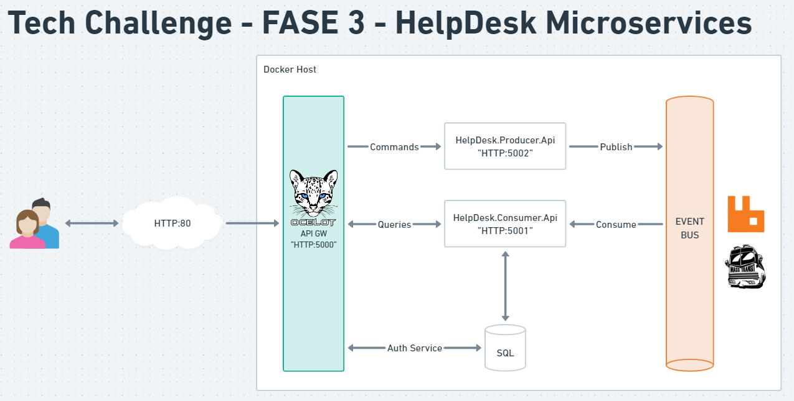
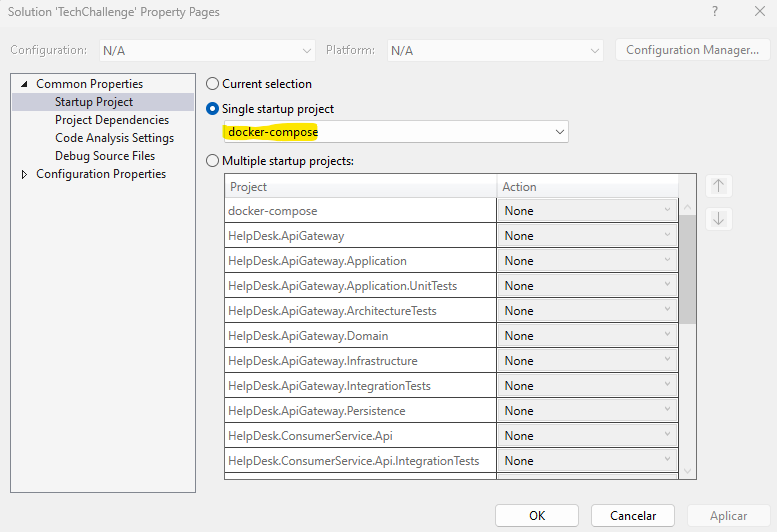
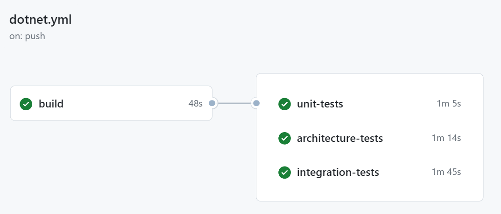

[](https://github.com/fiap-2nett/tc-fase3-microservices/actions/workflows/dotnet.yml)

# TechChallenge - HelpDesk API Microservices

Com o objetivo de manter o foco na criação de um ecossistema que utilize Microsserviços integrado com ferramentas de Mensageria (Brokers),
foi reaproveitado o projeto elaborado no Tech Challenge 1.

Caso queira verificar o projeto entregue na fase 1, vide link abaixo.:

- [Tech Challenge 1](https://github.com/fiap-2nett/tc-fase1)

O projeto atualizado no Tech Challenge 3 é altamente baseado em uma arquitetura Orientada à Eventos (Event Driven), ou seja, projetada para captura,
processamento e comunicação de eventos entre serviços de maneira desacoplada.


## Colaboradores

- [Ailton Alves de Araujo](https://www.linkedin.com/in/ailton-araujo-b4ba0520/) - RM350781
- [Bruno Fecchio Salgado](https://www.linkedin.com/in/bfecchio/) - RM350780
- [Cecília Gonçalves Wlinger](https://www.linkedin.com/in/cec%C3%ADlia-wlinger-6a5459100/) - RM351312
- [Cesar Julio Spaziante](https://www.linkedin.com/in/cesar-spaziante/) - RM351311
- [Paulo Felipe do Nascimento de Sousa](https://www.linkedin.com/in/paulo-felipe06/) - RM351707

## Tecnologias utilizadas

- .NET 7.0
- Entity Framework Core 7.0
- Swashbuckle 6.5
- FluentValidation 11.7
- FluentAssertions 6.12
- NetArchTest 1.3
- SqlServer 2019
- Docker 24.0.5
- Docker Compose 2.20
- Ocelot 23.0
- MassTransit 8.1.3
- MassTransitRabbitMQ 8.1.3

## Arquitetura, Padrões Arquiteturais e Convenções

- REST Api
- Event Driven
- Microservices
- Domain-Driven Design
- EF Code-first
- Service Pattern
- Repository Pattern & Unit Of Work
- Architecture Tests
- Unit Tests

## Desenho de Arquitetura

A solução foi arquitetada da seguinte maneira.:



Temos na frente um Microserviço de **Api Gateway** que atua como intermediário entre os clientes e os demais Microsserviços,
recebendo as requisições e aplicando as devidas regras para direcioná-las corretamente. O **Api Gateway** é responsável
também pela autenticação dos usuários.

Em seguida temos o Microserviço de **Producer** que recebe as requisições do **Api Gateway**, para
adição, atualização e exclusão de registros e as encaminha para o **Event Bus**.

Na sequência há o Microserviço de **Consumer** que recebe requisições do **Api Gateway**, para consulta de registros
depois consulta os dados por meio de requisições no **Event Bus** e os retorna para os usuários
via **Api Gateway**.

Por último temos nosso **Barramento de Eventos (Event Bus)** que recebe as requisições dos Microsserviços de **Producer**
e **Consumer**, as adiciona na fila de nosso Message Broker (no caso o RabbitMQ) por meio dos exchanges configurados, para que
estas requisições sejam processadas assincronamente.

Ao abrir o código da solução do HelpDesk API pode-se encontrar os seguintes projetos:

| Projeto                                          | Descrição                                                                                                                                                 |
|--------------------------------------------------|-----------------------------------------------------------------------------------------------------------------------------------------------------------|
| _HelpDesk.ApiGateway_                            | Contém a implementação dos endpoints de comunicação do Api Gateway.                                                                                       |
| _HelpDesk.ApiGateway.Application_                | Contém a implementação dos contratos de comunicação e classes de serviços do Api Gateway                                                                  |
| _HelpDesk.ApiGateway.Domain_                     | Contém a implementação das entidades e interfaces do domínio do Api Gateway.                                                                              |
| _HelpDesk.ApiGateway.Infrastructure_             | Contém a implementação dos componentes relacionados à infraestrutura do Api Gateway.                                                                      |
| _HelpDesk.ApiGateway.Persistence_                | Contém a implementação dos componentes relacionados à consulta e persistência de dados do Api Gateway.                                                    |
| _HelpDesk.ApiGateway.Application.UnitTests_      | Contém a implementação dos testes unitários focados nas classes de serviço do Api Gateway.                                                                |
| _HelpDesk.ApiGateway.ArchitectureTests_          | Contém a implementação dos testes de arquitetura do Api Gateway.                                                                                          |
| _HelpDesk.ApiGateway.IntegrationTests_           | Contém a implementação dos testes integrados do Api Gateway.                                                                                              |
| _HelpDesk.ConsumerService.Api_                   | Contém a implementação dos endpoints de comunicação do Microserviço de Consumer.                                                                         |
| _HelpDesk.ConsumerService.Application_           | Contém a implementação dos contratos de comunicação e classes de serviços do Microserviço de Consumer.                                                   |
| _HelpDesk.ConsumerService.Domain_                | Contém a implementação das entidades e interfaces do domínio do Microserviço de Consumer.                                                                |
| _HelpDesk.ConsumerService.Infrastructure_        | Contém a implementação dos componentes relacionados a infraestrutura do Microserviço de Consumer.                                                        | 
| _HelpDesk.ConsumerService.Persistence_           | Contém a implementação dos componentes relacionados a consulta e persistência de dados do Microserviço de Consumer.                                      |   
| _HelpDesk.ConsumerService.Application.UnitTests_ | Contém a implementação dos testes unitários focados nas classes de serviço do Microserviço de Consumer.                                                  |
| _HelpDesk.ConsumerService.ArchitectureTests_     | Contém a implementação dos testes de arquitetura do Microserviço de Consumer.                                                                            |  
| _HelpDesk.ConsumerService.Api.IntegrationTests_  | Contém a implementação dos testes integrados do Microserviço de Consumer.                                                                                |
| _HelpDesk.ProducerService.Api_                   | Contém a implementação dos endpoints de comunicação do Microserviço de Producer.                                                                         |
| _HelpDesk.ProducerService.Application_           | Contém a implementação dos contratos de comunicação e classes de serviços do Microserviço de Producer.                                                   |
| _HelpDesk.ProducerService.Domain_                | Contém a implementação das entidades e interfaces do domínio do Microserviço de Producer.                                                                |
| _HelpDesk.ProducerService.Infrastructure_        | Contém a implementação dos componentes relacionados à infraestrutura do Microserviço de Producer.                                                        |
| _HelpDesk.ProducerService.Persistence_           | Contém a implementação dos componentes relacionados à consulta e persistência de dados do Microserviço de Producer.                                      |
| _HelpDesk.ProducerService.Application.UnitTests_ | Contém a implementação dos testes unitários focados nas classes de serviço do Microserviço de Producer.                                                  |
| _HelpDesk.ProducerService.ArchitectureTests_     | Contém a implementação dos testes de arquitetura do Microserviço de Producer.                                                                            |
| _HelpDesk.Core.Domain_                           | Contém a implementação de classes compartilhadas comuns entre os Microserviços como, por exemplo, alguns Enumerators.                                     | 

## Modelagem de dados

A HelpDesk API utiliza o paradigma de CodeFirst através dos recursos disponibilizados pelo Entity Framework, no entanto para melhor
entendimento da modelagem de dados apresentamos a seguir o MER e suas respectivas definições:


Com base na imagem acima iremos detalhar as tabelas e os dados contidos em cada uma delas:

| Schema | Tabela       | Descrição                                                                                       |
|--------|--------------|-------------------------------------------------------------------------------------------------|
| dbo    | users        | Tabela que contém os dados referentes aos usuários da plataforma.                               |
| dbo    | roles        | Tabela que contém os dados referentes aos tipos de perfis de usuário da plataforma.             |
| dbo    | tickets      | Tabela que contém os dados referentes aos tickets criados na plataforma.                        |
| dbo    | ticketstatus | Tabela que contém os dados referentes aos possíveis status de tickets.                          |
| dbo    | categories   | Tabela que contém os dados referentes às categorias de tickets.                                 |
| dbo    | priorities   | Tabela que contém os dados referentes às prioridades/SLAs relacionado as categorias de tickets. |

## Como executar

A HelpDesk API utiliza como banco de dados o SQL Server 2019 e como Message Broker o RabbitMQ,
toda a infraestrutura necessária para execução deve ser provisionada automaticamente configurando
o docker-compose como projeto de inicialização no Visual Studio.



Após rodar o projeto a iteração pode ser feita pelo link abaixo.:

https://localhost:5000/swagger/index.html

Caso queira acompanhar a fila de execução do RabbitMQ, segue abaixo.:

http://localhost:15672/

### Testes unitários, integração e arquiteturais

A HelpDesk API disponibiliza testes automatizados para garantir que o processo contempla as regras de negócio pré-definidas no requisito
do projeto. Os testes são executados via Github CI/CD Pipeline conforme aprendemos durante o Tech Challenge 2.:



Se preferir, os testes também podem ser executados localmente via dotnet CLI. Para isso rode os comandos abaixo.:
```sh
$ dotnet test tests/HelpDesk.ApiGateway.Application.UnitTests/HelpDesk.ApiGateway.Application.UnitTests.csproj --no-build --verbosity normal
$ dotnet test tests/HelpDesk.ConsumerService.Application.UnitTests/HelpDesk.ConsumerService.Application.UnitTests.csproj --no-build --verbosity normal
$ dotnet test tests/HelpDesk.ProducerService.Application.UnitTests/HelpDesk.ProducerService.Application.UnitTests.csproj --no-build --verbosity normal
$ dotnet test tests/HelpDesk.ApiGatewayService.ArchitectureTests/HelpDesk.ApiGateway.ArchitectureTests.csproj --no-build --verbosity normal
$ dotnet test tests/HelpDesk.ConsumerService.ArchitectureTests/HelpDesk.ConsumerService.ArchitectureTests.csproj --no-build --verbosity normal
$ dotnet test tests/HelpDesk.ProducerService.ArchitectureTests/HelpDesk.ProducerService.ArchitectureTests.csproj --no-build --verbosity normal
$ dotnet test tests/HelpDesk.ApiGateway.IntegrationTests/HelpDesk.ApiGateway.IntegrationTests.csproj --no-build --verbosity normal
$ dotnet test tests/HelpDesk.ConsumerService.Api.IntegrationTests/HelpDesk.ConsumerService.Api.IntegrationTests.csproj --no-build --verbosity normal
```

Caso queria uma versão de resultado com mais detalhes, execute o seguinte comando:

```sh
$ dotnet test --logger "console;verbosity=detailed" <arquivo_do_projeto_do_teste.csproj>
```

### Obter JWT Bearer Tokens

Para consumir os endpoints é necessário obter o token bearer, por padrão o projeto irá criar alguns usuários fictícios com diferentes perfis
de acesso, são eles:

| Usuário                   | Senha       | Perfil        |
|---------------------------|-------------|---------------|
| admin@techchallenge.app   | Admin@123   | Administrador |
| ailton@techchallenge.app  | Ailton@123  | Geral         |
| bruno@techchallenge.app   | Bruno@123   | Analista      |
| cecilia@techchallenge.app | Cecilia@123 | Geral         |
| cesar@techchallenge.app   | Cesar@123   | Analista      |
| paulo@techchallenge.app   | Paulo@123   | Geral         |

Caso queira você poderá criar o seu próprio usuário através do endpoint:

```curl
POST /authentication/register
```

*Observação: para novos usuários será atribuído o perfil Geral.*

